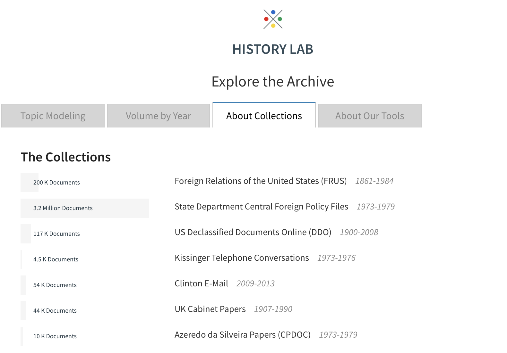

<!-- README.md is generated from README.Rmd. Please edit that file -->

# declass - R Package

The goal of `declass` R package is to allow people explore the vast archival records from Columbia University History Lab - Declassification Engine. 



## Example

```{r eval=FALSE}
library(declass)

# See what collections are there
declass_collection()

# See what entities are there the in the kissinger collection
declass_collection_entity("kissinger")

# See what countries were mentioned and how many times there're mentioned in the kissinger collection
declass_entity_data("kissinger", "countries")
```
